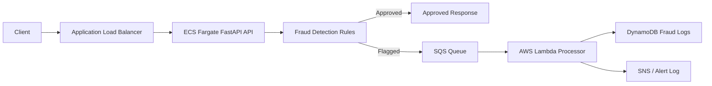

# Banking Fraud Detection and Customer Notification System

A cloud-native banking fraud detection and customer notification system built with **FastAPI, Docker, AWS ECS Fargate, Application Load Balancer, SQS, Lambda, DynamoDB, SNS, IAM, and Terraform**.

The system accepts banking transaction requests, evaluates them using rule-based fraud detection, approves valid transactions, and sends suspicious transactions to an asynchronous alert-processing pipeline.

## Overview

The project has two main components:

1. **Transaction Processing and Fraud Detection API**

   * Built with Python and FastAPI.
   * Deployed as a containerized service on AWS ECS Fargate.
   * Exposed publicly through an Application Load Balancer.
   * Accepts transaction details and applies fraud detection rules.
   * Returns `approved` for valid transactions.
   * Returns `flagged` for suspicious transactions and publishes the flagged event to SQS.

2. **Customer Notification and Alerting Processor**

   * Implemented as an AWS Lambda function.
   * Triggered by messages from SQS.
   * Stores flagged transactions in DynamoDB.
   * Sends customer alerts through SNS when configured, or logs the alert message.

## Architecture



The AWS deployment includes:

* ECS Fargate for the FastAPI transaction API
* Application Load Balancer for public API access
* SQS for decoupling the API from the alerting processor
* Lambda for processing flagged transactions
* DynamoDB for storing fraud logs
* SNS or log-based customer alerting
* IAM roles and policies for secure service access
* Terraform for infrastructure provisioning

## Fraud Detection Logic

The API evaluates each transaction using three deterministic fraud rules.

| Rule                                    | Condition                                                                             | Result           |
| --------------------------------------- | ------------------------------------------------------------------------------------- | ---------------- |
| Large withdrawal                        | `transaction_type` is `withdrawal` and `amount >= 5000`                               | Flag transaction |
| Failed login attempts                   | `failed_login_attempts >= 3`                                                          | Flag transaction |
| Different location in short time window | Same account has a previous transaction from a different location within `10` minutes | Flag transaction |

Risk score weights:

| Rule                                        | Risk Score |
| ------------------------------------------- | ---------- |
| Large withdrawal                            | `+50`      |
| Failed login attempts                       | `+30`      |
| Different location within short time window | `+40`      |

If the final risk score is greater than `0`, the transaction is marked as `flagged`.

If no fraud rules are triggered, the transaction is marked as `approved`.

## API Usage

### Health Check

```bash
curl http://localhost:8000/health
```

Example response:

```json
{
  "status": "healthy",
  "service": "Banking Fraud Detection API"
}
```

### Process Transaction

Endpoint:

```http
POST /transactions
```

Request body:

```json
{
  "account_id": "ACC123",
  "amount": 120,
  "transaction_type": "deposit",
  "location": "Toronto",
  "timestamp": "2026-06-01T10:00:00",
  "failed_login_attempts": 0
}
```

### Approved Transaction Example

```bash
curl -X POST http://localhost:8000/transactions \
  -H "Content-Type: application/json" \
  -d '{
    "account_id": "ACC123",
    "amount": 120,
    "transaction_type": "deposit",
    "location": "Toronto",
    "timestamp": "2026-06-01T10:00:00",
    "failed_login_attempts": 0
  }'
```

Example response:

```json
{
  "transaction_id": "a317c756-1772-4c61-aa59-f6e175083cb0",
  "account_id": "ACC123",
  "status": "approved",
  "reasons": [],
  "risk_score": 0,
  "message": "Transaction approved",
  "notification_status": null
}
```

### Flagged Transaction Example

```bash
curl -X POST http://localhost:8000/transactions \
  -H "Content-Type: application/json" \
  -d '{
    "account_id": "ACC999",
    "amount": 9000,
    "transaction_type": "withdrawal",
    "location": "Vancouver",
    "timestamp": "2026-06-01T11:00:00",
    "failed_login_attempts": 5
  }'
```

Example response:

```json
{
  "transaction_id": "575668f0-bf9b-4b2f-a332-410ddddba638",
  "account_id": "ACC999",
  "status": "flagged",
  "reasons": [
    "Unusually large withdrawal amount",
    "Too many failed login attempts before transaction"
  ],
  "risk_score": 80,
  "message": "Transaction flagged for review",
  "notification_status": {
    "published": true,
    "destination": "sqs"
  }
}
```

## Local Setup

Create and activate a virtual environment:

```bash
python -m venv .venv
source .venv/bin/activate
```

Install dependencies and create the local environment file:

```bash
pip install -r requirements.txt
cp .env.example .env
```

Run the FastAPI service:

```bash
uvicorn app.main:app --reload
```

Local endpoints:

* API root: `http://localhost:8000`
* Swagger UI: `http://localhost:8000/docs`
* Health check: `http://localhost:8000/health`

When `SQS_QUEUE_URL` is not configured and `LOCAL_FALLBACK_ENABLED=true`, flagged transactions are written locally to:

```text
local_data/flagged_transactions.jsonl
```

## Docker Run

Build and run the API locally with Docker Compose:

```bash
docker compose up --build
```

The API will be available at:

```text
http://localhost:8000
```

Swagger UI:

```text
http://localhost:8000/docs
```

## Lambda Processing

The Lambda function processes SQS events for flagged transactions.

For each flagged transaction, it:

1. Parses the SQS message body.
2. Stores the transaction in DynamoDB.
3. Publishes a customer alert to SNS when configured.
4. Logs the alert message when SNS is not configured.

Run the local Lambda test:

```bash
python lambda/local_test.py
```

For local testing, processed alerts are written to:

```text
local_data/lambda_processed_alerts.jsonl
```

## Terraform Deployment

Terraform files are located in the `infra/` directory.

The Terraform configuration provisions:

* ECR repository for the API Docker image
* ECS Fargate service for the FastAPI API
* Application Load Balancer and target group
* SQS queue for flagged transaction events
* Lambda function for processing flagged transactions
* DynamoDB table for storing fraud logs
* SNS topic for customer alerts
* IAM roles and policies
* CloudWatch log groups

### 1. Initialize Terraform

```bash
cd infra
terraform init
terraform fmt
terraform validate
```

### 2. Create the ECR repository

```bash
terraform apply \
  -target=aws_ecr_repository.api \
  -var="api_image_uri=placeholder"
```

### 3. Build and push the Docker image

```bash
ECR_REPOSITORY_URL=$(terraform output -raw ecr_repository_url)
ECR_REGISTRY=${ECR_REPOSITORY_URL%/*}
AWS_REGION=${AWS_REGION:-us-east-1}
IMAGE_TAG=$(date +%Y%m%d%H%M%S)

aws ecr get-login-password --region "$AWS_REGION" \
  | docker login --username AWS --password-stdin "$ECR_REGISTRY"

docker build -t banking-fraud-alert-system ..
docker tag banking-fraud-alert-system:latest "$ECR_REPOSITORY_URL:$IMAGE_TAG"
docker push "$ECR_REPOSITORY_URL:$IMAGE_TAG"
```

### 4. Deploy the full AWS stack

```bash
terraform plan \
  -var="api_image_uri=$ECR_REPOSITORY_URL:$IMAGE_TAG"

terraform apply \
  -var="api_image_uri=$ECR_REPOSITORY_URL:$IMAGE_TAG"
```

To configure an SNS email subscription during deployment:

```bash
terraform apply \
  -var="api_image_uri=$ECR_REPOSITORY_URL:$IMAGE_TAG" \
  -var="alert_email=you@example.com"
```

After deployment, confirm the SNS subscription email from AWS if email alerting is enabled.

## AWS Deployment Test Commands

Set output variables:

```bash
API_URL=$(terraform output -raw api_url)
DYNAMODB_TABLE_NAME=$(terraform output -raw dynamodb_table_name)
LAMBDA_FUNCTION_NAME=$(terraform output -raw lambda_function_name)
AWS_REGION=${AWS_REGION:-us-east-1}
```

Test the public health endpoint:

```bash
curl "$API_URL/health"
```

Send an approved transaction through the deployed API:

```bash
curl -X POST "$API_URL/transactions" \
  -H "Content-Type: application/json" \
  -d '{
    "account_id": "ACC123",
    "amount": 120,
    "transaction_type": "deposit",
    "location": "Toronto",
    "timestamp": "2026-06-01T10:00:00",
    "failed_login_attempts": 0
  }'
```

Send a flagged transaction through the deployed API:

```bash
curl -X POST "$API_URL/transactions" \
  -H "Content-Type: application/json" \
  -d '{
    "account_id": "ACC999",
    "amount": 9000,
    "transaction_type": "withdrawal",
    "location": "Vancouver",
    "timestamp": "2026-06-01T11:00:00",
    "failed_login_attempts": 5
  }'
```

Confirm Lambda processed the SQS message:

```bash
aws logs tail "/aws/lambda/$LAMBDA_FUNCTION_NAME" \
  --since 10m \
  --region "$AWS_REGION"
```

Confirm fraud logs were written to DynamoDB:

```bash
aws dynamodb scan \
  --table-name "$DYNAMODB_TABLE_NAME" \
  --region "$AWS_REGION"
```

## Deployed API Validation

The API was deployed on AWS ECS Fargate behind an Application Load Balancer.

API URL:

```text
http://banking-fraud-alert-system-alb-1896298204.us-east-1.elb.amazonaws.com
```

Validated cloud flow:

* `GET /health` returned a healthy response through the ALB
* Approved transaction returned `status: "approved"`
* Flagged transaction returned `status: "flagged"`
* Flagged transaction was published to SQS
* Lambda processed the SQS message
* DynamoDB stored the flagged transaction record
* SNS topic was configured for customer alerts

## Assumptions

* Fraud detection is intentionally rule-based and deterministic for clarity and explainability.
* The different-location rule uses in-memory account state inside the running API process.
* Local JSONL fallback files are used only for local development and testing.
* Customer alerts are sent through SNS when configured; otherwise, the Lambda logs the alert message.
* Terraform deploys the required AWS infrastructure in the configured AWS account and region.
