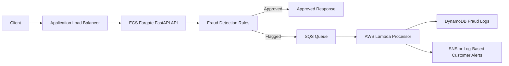

# Banking Fraud Detection and Customer Notification System

A cloud-based fraud detection system for banking transactions, built with FastAPI, Docker, AWS ECS Fargate, Application Load Balancer, SQS, Lambda, DynamoDB, SNS, IAM, and Terraform.

## Overview

The system exposes a FastAPI transaction API that accepts banking transaction requests, evaluates them with deterministic fraud rules, and returns either an `approved` or `flagged` decision.

Approved transactions return immediately. Flagged transactions are published to SQS, processed asynchronously by Lambda, stored in DynamoDB as fraud logs, and sent as customer alerts through SNS or log output.

## Architecture

The AWS deployment includes:

* ECS Fargate for the FastAPI transaction API
* Application Load Balancer for public API access
* SQS for flagged transaction events
* Lambda for processing flagged transactions
* DynamoDB for fraud logs
* SNS or log-based customer alerts
* IAM roles and policies for ECS, Lambda, SQS, DynamoDB, SNS, and CloudWatch Logs access
* Terraform infrastructure in `infra/`



For local development, SQS and DynamoDB can be replaced by JSONL fallback files so the transaction and Lambda flows can be tested without AWS credentials.

## Fraud Detection Logic

The API evaluates each transaction using three deterministic rules:

* Large withdrawal: `transaction_type` is `withdrawal` and `amount >= 5000`.
* Failed login attempts: `failed_login_attempts >= 3`.
* Different location in a short window: the same account has a previous transaction from a different location within `10` minutes.

Risk score weights are:

* Large withdrawal: `+50`.
* Failed login attempts: `+30`.
* Different location within the short time window: `+40`.

If the final risk score is greater than `0`, the transaction is marked as `flagged`. Otherwise, it is marked as `approved`.

## API Usage

Health check:

```bash
curl http://localhost:8000/health
```

Process an approved transaction:

```bash
curl -X POST http://localhost:8000/transactions \
  -H "Content-Type: application/json" \
  -d '{
    "account_id": "ACC123",
    "amount": 120,
    "transaction_type": "deposit",
    "location": "Toronto",
    "timestamp": "2026-06-01T10:00:00",
    "failed_login_attempts": 0
  }'
```

Process a flagged transaction:

```bash
curl -X POST http://localhost:8000/transactions \
  -H "Content-Type: application/json" \
  -d '{
    "account_id": "ACC123",
    "amount": 7000,
    "transaction_type": "withdrawal",
    "location": "Toronto",
    "timestamp": "2026-06-01T10:05:00",
    "failed_login_attempts": 4
  }'
```

Example flagged response:

```json
{
  "transaction_id": "9a558cd3-54a2-497e-bd38-697dd4875f1f",
  "account_id": "ACC123",
  "status": "flagged",
  "reasons": [
    "Unusually large withdrawal amount",
    "Too many failed login attempts before transaction"
  ],
  "risk_score": 80,
  "message": "Transaction flagged for review",
  "notification_status": {
    "published": true,
    "destination": "sqs"
  }
}
```

## Local Setup

Create and activate a virtual environment:

```bash
python -m venv .venv
source .venv/bin/activate
```

Install dependencies and create the local environment file:

```bash
pip install -r requirements.txt
cp .env.example .env
```

Run the FastAPI service:

```bash
uvicorn app.main:app --reload
```

Local API endpoints:

* API root: `http://localhost:8000`
* Swagger UI: `http://localhost:8000/docs`
* Health check: `http://localhost:8000/health`

When `SQS_QUEUE_URL` is not configured and `LOCAL_FALLBACK_ENABLED=true`, flagged transactions are written to `local_data/flagged_transactions.jsonl`.

## Docker Run

Build and run the FastAPI service with Docker Compose:

```bash
docker compose up --build
```

The API is available at `http://localhost:8000`, and Swagger UI is available at `http://localhost:8000/docs`.

## Lambda Processing

The Lambda handler processes SQS events for flagged transactions. For each record, it:

1. Parses the SQS message body.
2. Stores the flagged transaction in DynamoDB.
3. Publishes a customer alert to SNS when `SNS_TOPIC_ARN` is configured.
4. Logs the customer alert when SNS is not configured.

Run the local Lambda test:

```bash
python lambda/local_test.py
```

For local testing, processed alerts are written to `local_data/lambda_processed_alerts.jsonl`.

## Terraform Deployment

Terraform files are located in `infra/`. The configuration provisions the FastAPI API serving layer, asynchronous fraud alerting pipeline, fraud log storage, customer alerting resources, and IAM permissions.

Initialize Terraform:

```bash
cd infra
terraform init
terraform fmt
terraform validate
```

Create the ECR repository, build and push the API image, then deploy the full stack:

```bash
terraform apply -target=aws_ecr_repository.api -var="api_image_uri=placeholder"

ECR_REPOSITORY_URL=$(terraform output -raw ecr_repository_url)
ECR_REGISTRY=${ECR_REPOSITORY_URL%/*}
AWS_REGION=${AWS_REGION:-us-east-1}

aws ecr get-login-password --region "$AWS_REGION" \
  | docker login --username AWS --password-stdin "$ECR_REGISTRY"

docker build -t banking-fraud-alert-system ..
docker tag banking-fraud-alert-system:latest "$ECR_REPOSITORY_URL:latest"
docker push "$ECR_REPOSITORY_URL:latest"

terraform plan -var="api_image_uri=$ECR_REPOSITORY_URL:latest"
terraform apply -var="api_image_uri=$ECR_REPOSITORY_URL:latest"
```

Useful Terraform outputs:

* `api_url`: public API URL through the Application Load Balancer.
* `sqs_queue_url`: queue used for flagged transaction events.
* `dynamodb_table_name`: table used for fraud logs.
* `lambda_function_name`: Lambda processor name.
* `sns_topic_arn`: SNS topic used for fraud alerts.

## AWS Deployment Test Commands

Set deployment output variables:

```bash
cd infra
API_URL=$(terraform output -raw api_url)
DYNAMODB_TABLE_NAME=$(terraform output -raw dynamodb_table_name)
LAMBDA_FUNCTION_NAME=$(terraform output -raw lambda_function_name)
```

Test the public health endpoint:

```bash
curl "$API_URL/health"
```

Send a flagged transaction through the deployed API:

```bash
curl -X POST "$API_URL/transactions" \
  -H "Content-Type: application/json" \
  -d '{
    "account_id": "ACC123",
    "amount": 7000,
    "transaction_type": "withdrawal",
    "location": "Toronto",
    "timestamp": "2026-06-01T10:05:00",
    "failed_login_attempts": 4
  }'
```

Confirm Lambda processed SQS messages:

```bash
aws logs tail "/aws/lambda/$LAMBDA_FUNCTION_NAME" --since 10m
```

Confirm fraud logs were written to DynamoDB:

```bash
aws dynamodb scan --table-name "$DYNAMODB_TABLE_NAME"
```

## Assumptions

* Fraud detection is intentionally rule-based and deterministic for clarity and explainability.
* The different-location rule uses in-memory account state inside the running API process.
* Local JSONL fallback files are used only for local development and testing.
* Customer alerts are sent to SNS when configured; otherwise, the Lambda logs the alert message.
* Terraform deploys the assignment infrastructure in the configured AWS account and region.
