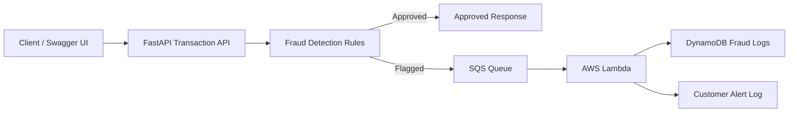

# Banking Fraud Detection and Customer Notification System

A cloud-native banking fraud detection and customer notification system built with **Python, FastAPI, AWS SQS, AWS Lambda, DynamoDB, Docker, and Terraform**.

The system accepts banking transaction requests, evaluates them using simple fraud detection rules, approves safe transactions, and sends suspicious transactions to an asynchronous alert-processing flow for customer alerting and record keeping.

## Overview

This project implements two main components:

1. **Transaction Processing and Fraud Detection API**

   * REST API built with FastAPI.
   * Accepts banking transaction details.
   * Applies fraud detection rules.
   * Marks transactions as either `approved` or `flagged`.
   * Publishes flagged transactions to SQS or local fallback storage.

2. **Customer Notification and Alerting Processor**

   * AWS Lambda-style processor for flagged transaction events.
   * Reads SQS-style messages.
   * Stores flagged transactions in DynamoDB or local fallback storage.
   * Logs a customer alert message.

## Architecture



For local development, SQS and DynamoDB are simulated using JSONL fallback files so the full flow can be tested without AWS credentials.

```text
Client
  -> FastAPI Transaction API
  -> Fraud Detection Rules
  -> Approved Response

If suspicious:
Client
  -> FastAPI Transaction API
  -> SQS Queue / Local JSONL fallback
  -> Lambda Processor
  -> DynamoDB / Local JSONL fallback
  -> Customer Alert Log
```

## Fraud Detection Logic

The API evaluates each incoming transaction using three deterministic rules.

| Rule                               | Condition                                                                             | Result           |
| ---------------------------------- | ------------------------------------------------------------------------------------- | ---------------- |
| Large withdrawal                   | `transaction_type` is `withdrawal` and `amount >= 5000`                               | Flag transaction |
| Failed login attempts              | `failed_login_attempts >= 3`                                                          | Flag transaction |
| Different location in short window | Same account has a previous transaction from a different location within `10` minutes | Flag transaction |

Risk score is calculated using simple rule weights:

| Rule                                        | Risk Score |
| ------------------------------------------- | ---------- |
| Large withdrawal                            | `+50`      |
| Too many failed login attempts              | `+30`      |
| Different location within short time window | `+40`      |

If the final risk score is greater than `0`, the transaction is marked as `flagged`.

If no rules are triggered, the transaction is marked as `approved`.

## API Usage

### Health Check

```http
GET /health
```

Example response:

```json
{
  "status": "healthy",
  "service": "Banking Fraud Detection API"
}
```

### Process Transaction

```http
POST /transactions
```

The endpoint evaluates an incoming transaction and returns the fraud decision.

### Request Body

```json
{
  "account_id": "ACC123",
  "amount": 120,
  "transaction_type": "deposit",
  "location": "Toronto",
  "timestamp": "2026-06-01T10:00:00",
  "failed_login_attempts": 0
}
```

### Approved Transaction Example

Request:

```bash
curl -X POST http://localhost:8000/transactions \
  -H "Content-Type: application/json" \
  -d '{
    "account_id": "ACC123",
    "amount": 120,
    "transaction_type": "deposit",
    "location": "Toronto",
    "timestamp": "2026-06-01T10:00:00",
    "failed_login_attempts": 0
  }'
```

Response:

```json
{
  "transaction_id": "d1784638-60dc-4340-907e-dcdf5d1a26f1",
  "account_id": "ACC123",
  "status": "approved",
  "reasons": [],
  "risk_score": 0,
  "message": "Transaction approved"
}
```

### Flagged Transaction Example

Request:

```bash
curl -X POST http://localhost:8000/transactions \
  -H "Content-Type: application/json" \
  -d '{
    "account_id": "ACC123",
    "amount": 7000,
    "transaction_type": "withdrawal",
    "location": "Toronto",
    "timestamp": "2026-06-01T10:05:00",
    "failed_login_attempts": 4
  }'
```

Response:

```json
{
  "transaction_id": "9a558cd3-54a2-497e-bd38-697dd4875f1f",
  "account_id": "ACC123",
  "status": "flagged",
  "reasons": [
    "Unusually large withdrawal amount",
    "Too many failed login attempts before transaction"
  ],
  "risk_score": 80,
  "message": "Transaction flagged for review",
  "notification_status": {
    "published": true,
    "destination": "local"
  }
}
```

## Local Setup

### 1. Create virtual environment

```bash
python -m venv .venv
source .venv/bin/activate
```

### 2. Install dependencies

```bash
pip install -r requirements.txt
```

### 3. Create environment file

```bash
cp .env.example .env
```

### 4. Run the FastAPI service

```bash
uvicorn app.main:app --reload
```

The API will be available at:

```text
http://localhost:8000
```

Swagger UI is available at:

```text
http://localhost:8000/docs
```

Health check:

```text
http://localhost:8000/health
```

## Run With Docker

The FastAPI service is container-ready using Docker.

```bash
docker compose up --build
```

Then open:

```text
http://localhost:8000/docs
```

## Local SQS Fallback

When `SQS_QUEUE_URL` is not configured and `LOCAL_FALLBACK_ENABLED=true`, flagged transactions are written to:

```text
local_data/flagged_transactions.jsonl
```

This allows the flagged transaction publishing flow to be tested locally without AWS.

## Lambda Processing

The Lambda handler processes SQS-style events.

For each flagged transaction, it:

1. Parses the SQS message body.
2. Adds alert metadata.
3. Stores the flagged transaction in DynamoDB if configured.
4. Uses local JSONL fallback storage when running locally.
5. Logs a customer alert message.

Run the local Lambda test:

```bash
python lambda/local_test.py
```

Processed alerts are written to:

```text
local_data/lambda_processed_alerts.jsonl
```

## Run Tests

```bash
pytest
```

The tests validate the main fraud detection rules:

* Normal transaction approval
* Large withdrawal flagging
* Failed login attempt flagging
* Different location within short time window

## Terraform Deployment

Terraform files are located in the `infra/` directory.

The Terraform configuration provisions the core fraud alerting pipeline:

* SQS queue for flagged transaction events
* Lambda function for processing flagged transactions
* DynamoDB table for storing fraud logs
* IAM role and policies for Lambda access to SQS, DynamoDB, and CloudWatch logs
* Event source mapping from SQS to Lambda

### Terraform Commands

```bash
cd infra
terraform init
terraform fmt
terraform validate
terraform plan
terraform apply
```

After deployment, use the Terraform output `sqs_queue_url` as the `SQS_QUEUE_URL` value for the FastAPI service.

## ECS/Fargate Deployment Note

The FastAPI service is containerized with the included `Dockerfile`.

For production deployment, this container can run on **Amazon ECS Fargate** behind an **Application Load Balancer**. The ECS task role would need permission to send flagged transaction messages to the SQS queue.

In this implementation, the Terraform focuses on the core asynchronous fraud alerting pipeline: **SQS, Lambda, DynamoDB, and IAM**. The API is Docker-ready and structured to be deployed to ECS/Fargate as the production serving layer.

## Environment Variables

| Variable                 | Description                                                        |
| ------------------------ | ------------------------------------------------------------------ |
| `APP_NAME`               | FastAPI application name                                           |
| `ENVIRONMENT`            | Runtime environment, such as `local` or `aws`                      |
| `AWS_REGION`             | AWS region                                                         |
| `SQS_QUEUE_URL`          | SQS queue URL for flagged transaction events                       |
| `DYNAMODB_TABLE_NAME`    | DynamoDB table for flagged transaction records                     |
| `LOCAL_FALLBACK_ENABLED` | Enables local JSONL fallback when AWS resources are not configured |

## Assumptions

* Fraud detection is intentionally rule-based and deterministic for simplicity and explainability.
* Customer notification is simulated using log messages.
* Local JSONL files are used only for local development and testing.
* The different-location rule uses in-memory account state for the local API process.
* In production, shared state such as DynamoDB, Redis, or another persistent store would be used for cross-instance fraud checks.
* The FastAPI service is Docker-ready for ECS/Fargate deployment, while the included Terraform provisions the core SQS, Lambda, DynamoDB, and IAM fraud alerting pipeline.
