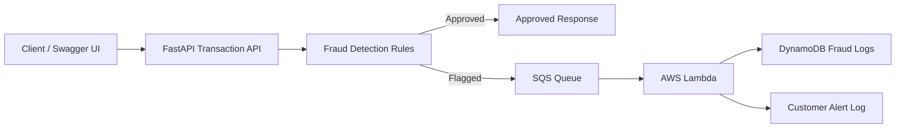

# Banking Fraud Alert System

A compact fraud-detection demo for banking transactions. The FastAPI service
accepts transaction requests, applies deterministic fraud rules, approves
low-risk transactions immediately, and sends suspicious transactions into an
asynchronous alert-processing path.

The project is designed to work in two modes:

- **Local demo mode** with Docker Compose and JSON Lines files as durable
  fallbacks.
- **AWS pipeline mode** where Terraform provisions SQS, Lambda, DynamoDB, IAM,
  KMS encryption, and Lambda tracing for flagged transactions.

## What The System Does

The API exposes a `POST /transactions` endpoint. Each request is scored against
simple fraud rules:

- Large withdrawals of `5000` or more are flagged.
- Transactions after `3` or more failed login attempts are flagged.
- Transactions from a different location within `10` minutes of the same
  account's previous transaction are flagged.

Approved transactions return directly from the API with `status: "approved"`.
Flagged transactions return `status: "flagged"` and are also published for
alert processing. In AWS, they go to SQS. Locally, when no queue URL is
configured, they are appended to `local_data/flagged_transactions.jsonl`.

## Architecture



For local development, SQS and DynamoDB are simulated using JSONL fallback files.
The FastAPI service is container-ready using Docker. In production, this
container can be deployed to ECS Fargate behind an Application Load Balancer.
The current Terraform provisions the core event-driven fraud alerting pipeline:
SQS, Lambda, DynamoDB, and IAM permissions.

```text
FastAPI container -> SQS -> Lambda -> DynamoDB
```

## Run Locally

Create a local environment file:

```bash
cp .env.example .env
```

Start the API:

```bash
docker compose up --build
```

The service is available at:

- `GET http://localhost:8000/health`
- `POST http://localhost:8000/transactions`

The default `.env.example` leaves `SQS_QUEUE_URL` and `DYNAMODB_TABLE_NAME`
empty and sets `LOCAL_FALLBACK_ENABLED=true`, so no AWS resources are required
for local development.

## Test Transactions Locally

Send an approved transaction:

```bash
curl -s -X POST http://localhost:8000/transactions \
  -H "Content-Type: application/json" \
  -d '{
    "account_id": "acct-100",
    "amount": 125.50,
    "transaction_type": "deposit",
    "location": "Toronto",
    "timestamp": "2026-06-01T10:00:00",
    "failed_login_attempts": 0
  }'
```

Expected result: the response has `status: "approved"`, an empty `reasons`
array, and `risk_score: 0`.

Send a flagged transaction:

```bash
curl -s -X POST http://localhost:8000/transactions \
  -H "Content-Type: application/json" \
  -d '{
    "account_id": "acct-200",
    "amount": 7000,
    "transaction_type": "withdrawal",
    "location": "Toronto",
    "timestamp": "2026-06-01T10:05:00",
    "failed_login_attempts": 4
  }'
```

Expected result: the response has `status: "flagged"`, includes fraud reasons,
and reports a `notification_status`. With the default local settings, the
flagged event is written to:

```text
local_data/flagged_transactions.jsonl
```

Run the rule tests:

```bash
python -m pytest
```

## Lambda Processing Locally

The Lambda handler in `lambda/handler.py` expects SQS-style events. Each record
contains a JSON transaction in `record["body"]`. The handler parses each record,
stores the flagged transaction, and prints a customer alert log message.

Run the local Lambda simulation:

```bash
python lambda/test_local.py
```

This builds a fake SQS batch with flagged transactions and invokes the handler
without AWS. Because `DYNAMODB_TABLE_NAME` is empty and local fallback is
enabled, processed alerts are appended to:

```text
local_data/lambda_processed_alerts.jsonl
```

There is also a smaller one-record helper:

```bash
python lambda/local_test.py
```

## Terraform Provisioning

The Terraform under `infra/` provisions the asynchronous AWS pipeline for
flagged transactions:

- SQS queue for flagged transaction events.
- Lambda processor triggered from the SQS queue.
- DynamoDB table keyed by `transaction_id` for processed flagged transactions.
- IAM role and policy granting the Lambda SQS, DynamoDB, CloudWatch Logs, and
  X-Ray permissions.
- Customer-managed KMS key for DynamoDB encryption at rest.
- Lambda X-Ray tracing.

Deploy from the `infra/` directory:

```bash
cd infra
terraform init
terraform plan
terraform apply
```

After `terraform apply`, use the `sqs_queue_url` output as `SQS_QUEUE_URL` for
the FastAPI service. In AWS mode, flagged API requests publish to SQS, the event
source mapping invokes Lambda, and Lambda writes processed transactions to
DynamoDB.

## Production ECS/Fargate Extension

The FastAPI app is container-ready through the root `Dockerfile` and
`docker-compose.yml`, but this Terraform module intentionally does not create
the API serving layer. A production extension would add:

- ECS cluster for the FastAPI service.
- Fargate task definition for the API Docker image, port `8000`, environment
  variables, and CloudWatch logging.
- Fargate service running the API in private subnets.
- Application Load Balancer in public subnets.
- Security groups allowing public HTTP traffic to the ALB and ALB-to-task
  traffic to the API.
- ECS task role with `sqs:SendMessage` permission for the flagged transaction
  queue.

## Assumptions And Tradeoffs

- Fraud detection is intentionally rule-based and deterministic so the behavior
  is easy to inspect in a local demo.
- Recent account location state is stored in process memory. This is fine for a
  single local API process, but production would need shared state such as Redis
  or DynamoDB.
- Local JSONL fallbacks make the project runnable without AWS credentials, but
  they are not a substitute for durable cloud storage.
- The Lambda logs customer alerts instead of sending email, SMS, SES, or SNS
  messages. This keeps the alerting side effect visible without requiring extra
  provider setup.
- Terraform focuses on the asynchronous fraud pipeline. ECS/Fargate and ALB are
  documented as the next deployment layer rather than provisioned here.
- The current rules prioritize explainability over advanced fraud scoring.

## Future Improvements

- Add ECS Fargate, ALB, VPC, subnet, and API task-role resources to Terraform.
- Send real customer alerts through SNS, SES, or an internal notification
  service.
- Replace in-memory location tracking with shared, time-windowed state.
- Add a dead-letter queue for failed Lambda processing.
- Add API authentication, request validation hardening, and rate limiting.
- Add structured JSON logging, metrics, alarms, and dashboards.
- Add integration tests that exercise the FastAPI-to-SQS-to-Lambda path with AWS
  mocks or localstack.
- Expand fraud detection with configurable thresholds, velocity checks, and
  model-based scoring.
